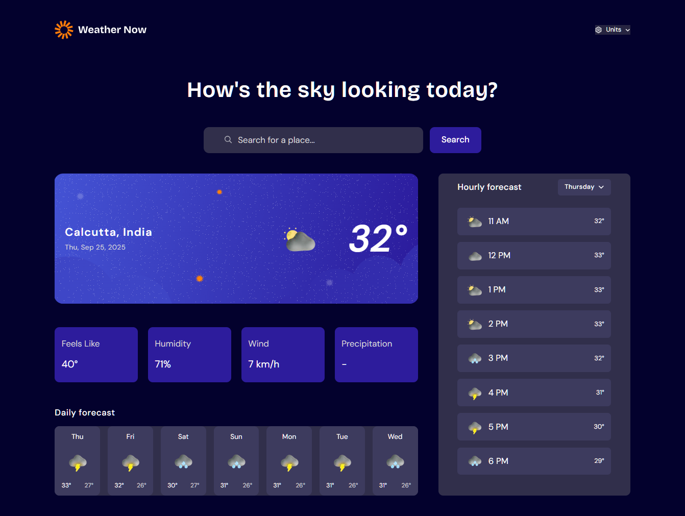

# Frontend Mentor - Weather App 🌦️



## Welcome! 👋

Thanks for checking out my solution to the **Frontend Mentor Weather App** challenge.  
This project was built using **React + Tailwind CSS** and powered by the [Open‑Meteo API](https://open-meteo.com/).

---

## 🚀 Features

Users can:

- 🔍 Search for weather information by entering a location in the search bar  
- 🌡️ View current weather conditions (temperature, feels‑like, humidity, wind speed, precipitation)  
- 🗺️ See location details (city + country)  
- 📅 Browse a **7‑day forecast** with daily high/low temperatures and weather icons  
- ⏰ View an **hourly forecast** showing temperature changes throughout the day  
- 📌 Switch between days of the week in the hourly forecast section  
- ⚙️ Toggle between **Celsius ↔ Fahrenheit**, **km/h ↔ mph**, and **mm ↔ inch**  
- 📱 Enjoy a fully responsive layout across devices  
- 🖱️ See hover and focus states for all interactive elements  

---

## 🛠️ Built With

- **React (Hooks + useEffect)** for state management and API calls  
- **Tailwind CSS** for styling and utility classes  
- **Framer Motion** for subtle animations  
- **Open‑Meteo Geocoding API** for location lookup  
- **Open‑Meteo Forecast API** for weather data  

---

## ⚙️ How It Works

1. User enters a city name → triggers geocoding API.  
2. Latitude/longitude are resolved → passed into forecast API.  
3. Forecast data is displayed with current, hourly, and daily breakdowns.  
4. Unit toggles update the API query parameters dynamically.  
5. A custom loading state machine ensures smooth UX, even for duplicate searches.  

---

## 📂 Project Structure

```
src/
 ├─ components/     # UI components
 ├─ hooks/          # custom hooks (if any)
 ├─ assets/         # icons, images
 ├─ App.jsx         # main app logic
 └─ index.js        # entry point
```

---

## 🌍 Live Demo

👉 [Live Site URL](https://weather-app-main-lyart.vercel.app)  


---

## 🧑‍💻 My Process

- Started with **HTML structure** and semantic markup.  
- Integrated **Tailwind** for rapid styling.  
- Connected **Open‑Meteo APIs** for geocoding + forecast.  
- Implemented **state machine logic** for handling duplicate searches and spinner resets.  
- Added **animations** and responsive tweaks for polish.  

---

## 📚 What I Learned

- How to chain multiple API calls (geocoding → forecast).  
- Managing **loading states** across async flows.  
- Using Tailwind’s arbitrary values to customize animation speeds (`animate-[spin_3s_linear_infinite]`).  
- Designing a clean UX for unit toggles and forecast browsing.  

---

## 🚀 Deployment

Deployed with [Vercel](https://weather-app-main-lyart.vercel.app)

---

## 🙌 Acknowledgments

- [Frontend Mentor](https://www.frontendmentor.io) for the challenge.  
- [Open‑Meteo](https://open-meteo.com/) for the free weather API.  

---

## 📬 Feedback

I’d love feedback on:
- My approach to handling **duplicate searches**  
- The **loading state machine** design  
- Accessibility improvements (screen reader flows, semantic HTML)

---

**Have fun building!** 🚀


